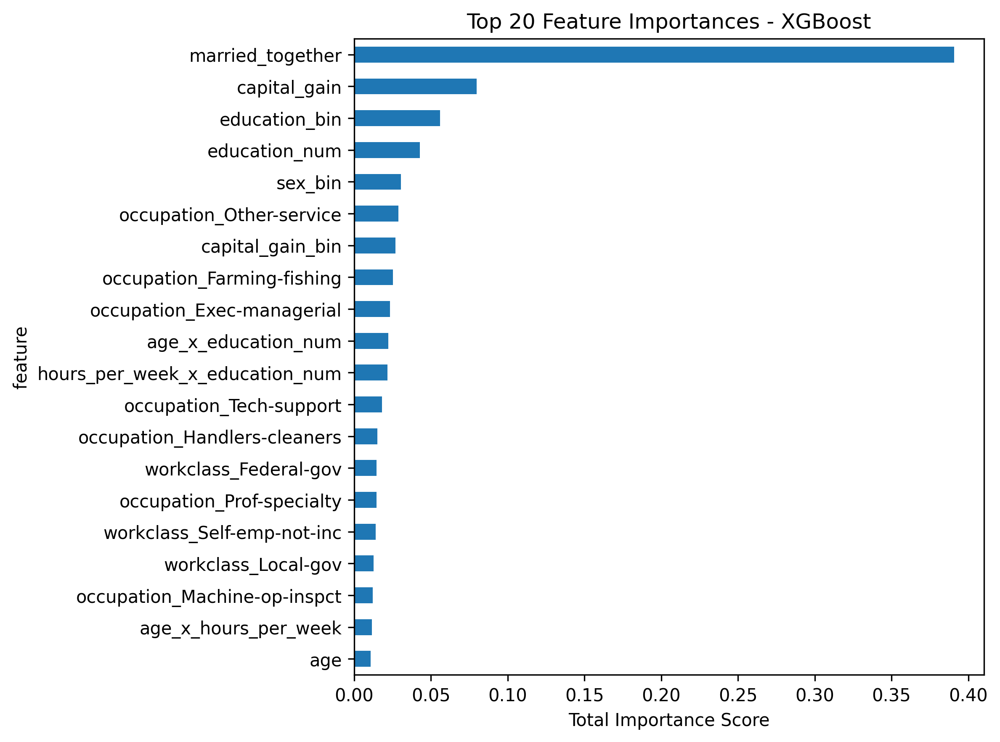
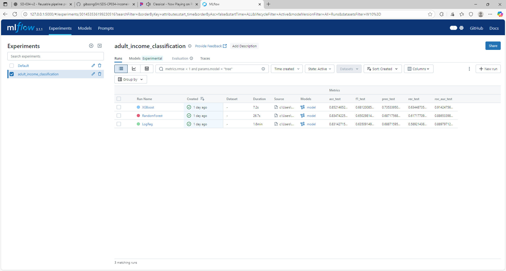

# 📄 IncomeInsight – Project Report - 🟢 **Beginner Track**

Welcome to your personal project report!  
Use this file to answer the key reflection questions for each phase of the project. This report is designed to help you think like a data scientist, guide AI tools more effectively, and prepare for real-world job interviews.

---

## ✅ Week 1: Setup & Exploratory Data Analysis (EDA)

> Answer the EDA questions provided in the project materials here. Focus on data quality, trends, anomalies, and relationships.

### 🔑 Question 1: What features show the strongest correlation with earning >$50K?
education.num is the strongest correlation.  A second tier score closely together:  age, hours.per.week, gender and capital_gain.
But, marital.status and relationship become the most correlated with income when using married/not-married binary, and capital gain comes after education.num when used as a binary column.

### 🔑 Question 2: How does income vary with education, marital status, or hours worked per week?
Education correlates well with income, showing the majority of Masters, Doctorate and Professional-School achievers earn >$50K
Married spouses that are together have substantially more earners >$50K than other categories which have 10% or less.
There are many outliers pertaining to hours worked, but the interquartile range (50% of population) is above 40 hours per week for >$50K, and below 40 hours for <=$50K

### 🔑 Question 3: Are there disparities across race, sex, or native country?
Yes, White and Asian-Pacific-Islander have double the percentage of >$50K earners than the third category Black.
Males have nearly triple the earners >$50K than females.
Native countries range from ~45% of earners >$50K if from Taiwan to some areas with 0%
There is a native.country called "South" which is a known issue in US Census data and actually South Korea

### 🔑 Question 4: Do capital gains/losses strongly impact the income label?
Capital losses are not as significant as capital gains, and capital gains correlated better as binary (zero gains or not zero gains)

---

## ✅ Week 2: Feature Engineering & Data Preprocessing

### 🔑 Question 1:
**Which features in the dataset appear to have the strongest relationship with the income label (>50K), and how did you determine this?**  
🎯 *Purpose: Tests ability to identify influential predictors through EDA.*

💡 **Hint:**  
Use `.groupby('income')` to compare mean values of numeric features.  
Use bar plots or violin plots for categorical features vs. income.  
Check chi-squared test or information gain if desired.

✏️ *Your answer here...*
income              <=50K       >50K
education.num        9.63      11.61  Highest correlation and three levels higher education
age                 36.61      43.96  Avg age of higher earnings is seven years over lower
hours.per.week      39.35      45.71  Higher earners work on average almost 6.5 hours more per week
capital.loss        53.45     193.75  Higher earners have more disposable income to invest or risk on assets
capital.gain       148.89    3937.68  
fnlwgt          190338.65  188149.96  No impact

Bar plots clearly showed all categorical features influence income, but statistically relationship is stronger than marital.status, and workclass is least.

	Feature	        Chi2 Score	p-value
4	relationship	3435.49	    0.00
0	marital.status	982.38	    0.00
6	education	    264.65	    0.00
2	occupation	    218.59	    0.00
5	race	        29.33	    0.00
1	native.country	16.73	    0.00
3	workclass	    4.06	    0.04
---

### 🔑 Question 2:
**Did you engineer any new features from existing ones? If so, explain the new feature(s) and why you think they might help your classifier.**  
🎯 *Purpose: Tests creativity and business-driven reasoning in feature creation.*

💡 **Hint:**  
Consider grouping `education_num` into bins, creating a `has_capital_gain` flag, or interaction terms like `hours_per_week * education_num`.

✏️ *Your answer here...*
An AI answer stated capital.gain was second most correlated number, though numerically it was fourth.  Additional prompting showed the skewness of the data toward zero was an indication to use it as a binary, which was being weighed behind-the-scenes.

Using this example - binary marital.status and binary relationship were the most correlated new columns.  They also correlate perfectly with each other.  As marital status is easier to understand than relationship with head of household, I will drop relationship.

Binning can reduce granularity and outliers, and education vs. earnings is not always linear.  

Interaction terms can boost accuracy by revealing hidden patterns and finer distinctions, as well as allow models to simulate nonlinear relationships.  Created hours_per_week * education_num, hours_per_week * age, capital_gain * education_num.

There are too many countries to encode them all (42).  Cut-offs by low representation were always unbalanced 80/20 splits regarding income.  Instead, 19 of the countries had very high percentages of low income
records (>90%), and those native_countries were turned into "Other" to be an indicating feature.

---

### 🔑 Question 3:
**Which continuous features required scaling or transformation before modeling, and which method did you use?**  
🎯 *Purpose: Connects feature scaling to model compatibility.*

💡 **Hint:**  
Use `df.describe()` and `hist()` to evaluate spread.  
Logistic Regression is sensitive to feature scale; Random Forest is not.  
Apply `StandardScaler` or `MinMaxScaler` accordingly.

✏️ *Your answer here...*
Capital.gain is skewed and I applied MinMax, while age, education.num and avg_hours_ are more normally distributed and I applied Standard.

---

### 🔑 Question 4:
**Is the target variable (`income`) imbalanced? How did you check, and what will you do (if anything) to handle it?**  
🎯 *Purpose: Tests understanding of classification imbalances and impact on metrics.*

💡 **Hint:**  
Use `.value_counts(normalize=True)`.  
If imbalance exists, consider using class weights, SMOTE, or stratified splits.  
Mention implications for precision, recall, and F1.

✏️ *Your answer here...*
The target variable is imbalanced as 75% of the count belongs to <=50K
income_counts = data_cleaned['income'].value_counts(normalize=True)
I will use class_weight='balanced' in my model then evaluate with f1_score and recall.  If that underperforms, I will use SMOTE to create synthetic minority data. 

---

### 🔑 Question 5:
**What does your final cleaned dataset look like before modeling? Include shape, types of features (numerical/categorical), and a summary of the preprocessing steps applied.**  
🎯 *Purpose: Encourages documentation and preparation for modeling.*

💡 **Hint:**  
Use `df.shape`, `df.dtypes`, and summarize what was dropped, encoded, scaled, or engineered.

✏️ *Your answer here...*

Preprocessing:
- Binary conversion of sex, income and marital_status
- Binned education_num, then ordinal encoded those groups
- One hot encoded categories 'occupation', 'workclass', 'native_country', 'race'
- Made interaction terms from numerical 'hours_per_week', 'education_num', 'age', 'capital_gain'
- StandardScaler age, hours_per_week
- MinMaxScaler capital_gain

I dropped fnlwgt and capital loss as they had the lowest correlations, dropped education as was binned and encoded into fewer categories.

56 columns, 30,162 rows
3 floats from scaling, 7 integers (4 binary, 3 interaction terms) and the remainder boolean encodings of race, workclass, occupation and a reduced number of countries.

---

### ✅ Week 3: Model Development & Experimentation

### 🔑 Question 1:
**Which classification models did you train for predicting income, and what are the strengths or assumptions of each model?**  
🎯 *Purpose: Tests understanding of algorithm selection and fit for the problem.*

💡 **Hint:**  
Train Logistic Regression (baseline, interpretable), Random Forest (handles non-linearities), and XGBoost (boosted performance).  
Explain what each model assumes (e.g., linearity in Logistic Regression) or does well (e.g., handling missing values, feature interactions).

✏️ *Your answer here...*
Logistic Regression - fast, works well when relationship between predictors and target are approximately linear, which is also the assumption, along with independent, scaled features.

Random Forest - can handle numeric and categorical features, non-linearity, outliers and does not require scaling.  Also provides feature importance.  It requires many
low-correlation decision trees for accuracy and stability.

XGBoost - Highly accurate and handles non-linearity and missing values while avoiding overfitting with regularization.  Assumes each new tree corrects the errors of previous trees 
and hyperparameters will be properly tuned for best results.
---

### 🔑 Question 2:
**How did each model perform based on your evaluation metrics (accuracy, precision, recall, F1-score, ROC-AUC)? Which performed best, and why?**  
🎯 *Purpose: Tests ability to evaluate and compare classifiers fairly.*

💡 **Hint:**  
Use `classification_report`, `confusion_matrix`, and `roc_auc_score`.  
Show results in a table or chart.  
Explain model strengths (e.g., better recall = catches more high-income earners).

✏️ *Your answer here...*
				acc_test	prec_test	rec_test	f1_test		roc_auc_test
XGBoost			0.852		0.735		0.634		0.681		0.914248
RandomForest	0.834		0.687		0.617		0.650		0.886534
LogReg			0.831		0.688		0.589		0.635		0.889797

XGBoost had highest scores in all evaluation metrics as it handles tabular, mixed-type, non-linear data well, while regularization helps find the right balance between fitting the training set and generalizing to unseen data.  

---

### 🔑 Question 3:
**Is your model biased toward one class (>$50K or ≤$50K)? How did you detect this, and what might you do to fix it?**  
🎯 *Purpose: Tests understanding of class imbalance and metric interpretation.*

💡 **Hint:**  
Inspect confusion matrix, precision/recall per class.  
Use `.value_counts()` on the `income` label to see imbalance.  
Consider using `class_weight='balanced'` or resampling techniques.

✏️ *Your answer here...*
75% of the income records are <50K.  The confusion matrix has low recall for >50K and bias towards predicting <=50K
              precision    recall  f1-score   support

        ≤50K       0.88      0.92      0.90      4531
        >50K       0.74      0.63      0.68      1502

    accuracy                           0.85      6033
   macro avg       0.81      0.78      0.79      6033
weighted avg       0.85      0.85      0.85      6033

XGBoost has an imbalance-handling parameter scale_pos_weight.  Once applied, recall for >50K improved from 0.63 to 0.83, but precision dropped from 0.74 to 0.60.
       precision    recall  f1-score   support

        ≤50K       0.94      0.82      0.87      4531
        >50K       0.60      0.83      0.70      1502

    accuracy                           0.82      6033
   macro avg       0.77      0.82      0.78      6033
weighted avg       0.85      0.82      0.83      6033

---

### 🔑 Question 4:
**What features were most important in your best-performing model, and do they align with expectations about income prediction?**  
🎯 *Purpose: Tests interpretability and domain reasoning.*

💡 **Hint:**  
Use `.feature_importances_` for tree models or `.coef_` for Logistic Regression.  
Do features like `education`, `occupation`, or `hours_per_week` appear at the top?  
Visualize using bar plots.

✏️ *Your answer here...*
The binary flag indicating married was by far the strongest indicator and makes sense that a couple's earnings would generally be higher than an individual.
The value of capital gain was a distant second, but I had expected the binary indicator to be more helpful based on the correlation.
Binning education did make it more useful than original education_num.
Interaction terms using education_num more than doubled the importance of age and hours per week

	feature	importance
31	married_together				0.390
27	capital_gain					0.079
26	education_bin					0.055
29	education_num					0.042
32	sex_bin							0.030
14	occupation_Other-service		0.028
33	capital_gain_bin				0.026
11	occupation_Farming-fishing		0.025
10	occupation_Exec-managerial		0.023
35	age_x_education_num				0.022
36	hours_per_week_x_education_num	0.021

---

### 🔑 Question 5:
**How did you use MLflow to track your model experiments, and what comparisons did it help you make?**  
🎯 *Purpose: Tests reproducibility and experiment tracking skills.*

💡 **Hint:**  
Log model name, hyperparameters, evaluation metrics, and notes.  
Use MLflow’s comparison view to track which run performed best.  
Share screenshots or describe insights gained.

✏️ *Your answer here...*

Still learning this.  adult_income_classification using parameters C, base_score, booster.  Compared accuracy, precision, recall, f1, roc_auc and XGBoost highest on all.

---

## ✅ Week 4: Model Selection & Hyperparameter Tuning

### 🔑 Question 1:

### 🔑 Question 2:

### 🔑 Question 3:

### 🔑 Question 4:

### 🔑 Question 5:

---

## ✅ Week 5: Model Deployment

> Document your approach to building and deploying the Streamlit app, including design decisions, deployment steps, and challenges.

### 🔑 Question 1:

### 🔑 Question 2:

### 🔑 Question 3:

### 🔑 Question 4:

### 🔑 Question 5:

---

## ✨ Final Reflections

> What did you learn from this project? What would you do differently next time? What did AI tools help you with the most?

✏️ *Your final thoughts here...*
I had previously reached my quota on Copilot and Cursor.  This project was entirely on ChatGPT.  I learned Feature Engineering and preprocessing are separate, one for exploring and the other for automating, and starting to use MLflow.  There was substantially more code than I anticipated.  I was also asking AI piecemeal questions and I could not put the components together.  Next time, I will ask AI expansive questions pertaining to the entire project to get more integrated end to end code.

---
