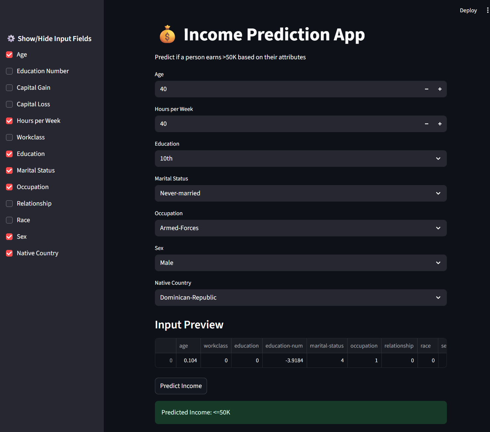

# 📄 IncomeInsight – Project Report - 🟢 **Beginner Track**

Welcome to your personal project report!  
Use this file to answer the key reflection questions for each phase of the project. This report is designed to help you think like a data scientist, guide AI tools more effectively, and prepare for real-world job interviews.

---

## ✅ Phase 1: Setup & Exploratory Data Analysis (EDA)

> Answer the EDA questions provided in the project materials here. Focus on data quality, trends, anomalies, and relationships.

### 🔑 Question 1: What features show the strongest correlation with earning >$50K?
✅ Answer 1: Education, Age and Hours per week

### 🔑 Question 2: How does income vary with education, marital status, or hours worked per week?
✅ Answer 2: Higher education, being Married and working more hours positively correlate with higher earnings (>50k)

### 🔑 Question 3: Are there disparities across race, sex, or native country?
✅ Answer 3: Sex ==> Men earns higher than Women
        Race ==> Whites and Asians are earnong high than other races
        Native ==> Iran, France and India are leading in earnings.
                   outlying-us, holand-netherlands, dominican-republic are least in order.

### 🔑 Question 4: Do capital gains/losses strongly impact the income label?
✅ Answer 4: None => lowest proportion of >50K earners.
        Loss => medium proportion—higher than “none” but lower than “gain”.
        Gain => highest proportion—confirms strong association of capital gains with higher income.

---

## ✅ Phase 2: Model Development

> This phase spans 3 weeks. Answer each set of questions weekly as you build, train, evaluate, and improve your models.

---

### 🔍 Week 1: Laying the Foundation

#### 🔑 Question 1:
**Which features in the dataset appear to have the strongest relationship with the income label (>50K), and how did you determine this?**  
🎯 *Purpose: Tests ability to identify influential predictors through EDA.*

💡 **Hint:**  
Use `.groupby('income')` to compare mean values of numeric features.  
Use bar plots or violin plots for categorical features vs. income.  
Check chi-squared test or information gain if desired.

✏️ ✅ Answer 1: As per the below workouts, Capital Gain has very strong relationship with the income in numerical features. 
In Categorical: Education, Marital status show significant difference by income.

# 1. Find the mean differnce for numeric features
#numeric_cols = ['age', 'education.num', 'hours.per.week', 'capital.gain', 'capital.loss']
#df.groupby('income')[numeric_cols].mean()
mean_values = df.groupby('income')[numeric_cols].mean()
mean_diff = mean_values.loc['>50K'] - mean_values.loc['<=50K']
mean_diff = mean_diff.sort_values(ascending=False)
summary = mean_values.T
summary['mean_diff'] = mean_diff
print("\nSummary table:\n", summary)

Summary table:
 income               <=50K         >50K    mean_diff
age              36.783738    44.249841     7.466103
education.num     9.595065    11.611657     2.016592
hours.per.week   38.840210    45.473026     6.632816
capital.gain    148.752468  4006.142456  3857.389989
capital.loss     53.142921   195.001530   141.858610

#  Capital Gain has the largest mean difference, suggesting a very strong relationship.

---

#### 🔑 Question 2:
**Did you engineer any new features from existing ones? If so, explain the new feature(s) and why you think they might help your classifier.**  
🎯 *Purpose: Tests creativity and business-driven reasoning in feature creation.*

💡 **Hint:**  
Consider grouping `education_num` into bins, creating a `has_capital_gain` flag, or interaction terms like `hours_per_week * education_num`.

✏️ ✅ Answer 2: Yes — I created "cap_activity" a derived feature combining both capital gain and loss into a single feature with values,

'none' if both are zero, 
'gain' if capital-gain > 0,
'loss' if capital-loss > 0

I added this for a Combined Visualize of Capital Gain and Loss

---

#### 🔑 Question 3:
**Which continuous features required scaling or transformation before modeling, and which method did you use?**  
🎯 *Purpose: Connects feature scaling to model compatibility.*

💡 **Hint:**  
Use `df.describe()` and `hist()` to evaluate spread.  
Logistic Regression is sensitive to feature scale; Random Forest is not.  
Apply `StandardScaler` or `MinMaxScaler` accordingly.

✏️ ✅ Answer 3: I used StandardScaler ( mean diff and standard deviation) to transform the numeric features so to put them on similar scales.
        #numeric_cols = ['age', 'education.num', 'hours.per.week', 'capital.gain', 'capital.loss']

---

#### 🔑 Question 4:
**Is the target variable (`income`) imbalanced? How did you check, and what will you do (if anything) to handle it?**  
🎯 *Purpose: Tests understanding of classification imbalances and impact on metrics.*

💡 **Hint:**  
Use `.value_counts(normalize=True)`.  
If imbalance exists, consider using class weights, SMOTE, or stratified splits.  
Mention implications for precision, recall, and F1.

✏️ ✅ Answer 4: Yes, imbalanced ( <=50K is 75.919044 and >50K is 24.080956 )
Will take care in the Model phase using split with "Startify = y" in train_test_split()

---

#### 🔑 Question 5:
**What does your final cleaned dataset look like before modeling? Include shape, types of features (numerical/categorical), and a summary of the preprocessing steps applied.**  
🎯 *Purpose: Encourages documentation and preparation for modeling.*

💡 **Hint:**  
Use `df.shape`, `df.dtypes`, and summarize what was dropped, encoded, scaled, or engineered.

✏️ ✅ Answer 5: Replaced all ? and handled missing values. 
df.shape ==> (32561, 17)
All numeric columns are scaled and ready for modelling : age, education-num, hours-per-week, capital-gain, capital-loss
All Categorical features are imputed and encoded : workclass, education, marital-status, occupation, relationship, race, sex, native-country
Added new target feature income_bin (0 = ≤50K, 1 = >50K)
Added new derived feature cap_activity  categorized as 'none', 'loss', 'gain'

---

---

### 📆 Week 2: Model Development & Experimentation

### 🔑 Question 1:

### 🔑 Question 2:

### 🔑 Question 3:

### 🔑 Question 4:

### 🔑 Question 5:

---

### 📆 Week 3: Model Tuning

### 🔑 Question 1:

### 🔑 Question 2:

### 🔑 Question 3:

### 🔑 Question 4:

### 🔑 Question 5:

---

## ✅ Phase 3: Model Deployment

> Document your approach to building and deploying the Streamlit app, including design decisions, deployment steps, and challenges.

### 🔑 Question 1:

### 🔑 Question 2:

### 🔑 Question 3:

### 🔑 Question 4:

### 🔑 Question 5:

---

## ✨ Final Reflections

> What did you learn from this project? What would you do differently next time? What did AI tools help you with the most?

✏️ *Your final thoughts here...*

---
